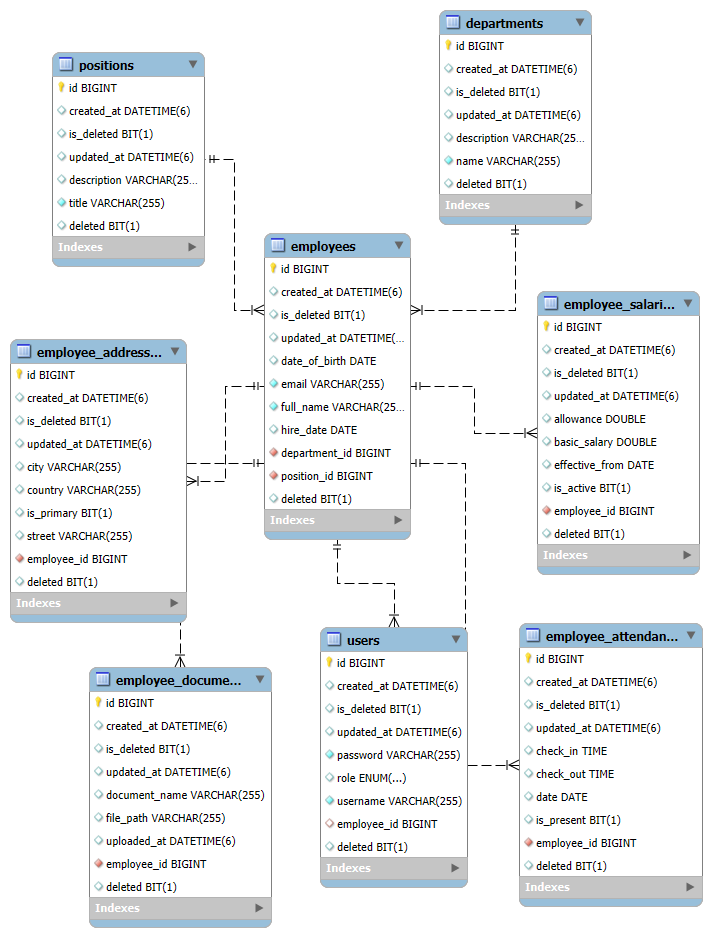

# Employee Management System (EMS)
A production-ready Spring Boot REST API for managing employees, departments, positions, salaries, attendance, addresses, and document uploads.

## Tech Stack
* Spring Boot and JPA
* Spring Security (JWT Authentication)
* Role-Based Authorization (ADMIN / EMPLOYEE)
* MySQL
* Docker & Docker Compose
* File upload support (PDF / Images) and UUID based file storage
* pagination and global exception handling
* Layered Architecture
* API Versioning capability

## Core Entities
* Department
* Position
* Employee
* EmployeeAddress
* EmployeeSalary
* EmployeeAttendance
* EmployeeDocument
* User (for authentication)

## Base URL
http://localhost:8080/api/v1

## Public URL
`POST   /api/v1/auth/login`

## Users (ADMIN only)
`POST   /api/v1/users`  
`GET    /api/v1/users`  
`GET    /api/v1/users/{id}`  
`PUT    /api/v1/users/{id}`  
`DELETE /api/v1/users/{id}`  

## Departments 
### ADMIN
`POST   /api/v1/departments`  
`PUT    /api/v1/departments/{id}`  
`DELETE /api/v1/departments/{id}`  
### ADMIN + EMPLOYEE
`GET    /api/v1/departments`  
`GET    /api/v1/departments/{id}`  

## Positions
### ADMIN
`POST   /api/v1/positions`  
`PUT    /api/v1/positions/{id}`  
`DELETE /api/v1/positions/{id}`  
### ADMIN + EMPLOYEE
`GET    /api/v1/positions`
`GET    /api/v1/positions/{id}`

## Employees
### ADMIN
`POST   /api/v1/employees`  
`GET    /api/v1/employees`  
`GET    /api/v1/employees/{id}`  
`PUT    /api/v1/employees/{id}`  
`DELETE /api/v1/employees/{id}`  
### EMPLOYEE
`GET    /api/v1/employees/me`  
`PUT    /api/v1/employees/me`  

## Employee Addresses
### ADMIN
`POST   /api/v1/addresses/{employeeId}`  
`DELETE /api/v1/addresses/{addressId}`  
`GET    /api/v1/addresses/{employeeId}`  
### EMPLOYEE
`GET    /api/v1/addresses/me`  
`POST   /api/v1/addresses/me`  
`DELETE /api/v1/addresses/me/{addressId}`  

## Employee Salary
### ADMIN
`POST   /api/v1/salaries/{employeeId}`  
`GET    /api/v1/salaries/{employeeId}`  
`GET    /api/v1/salaries/{employeeId}/active`  
`PUT    /api/v1/salaries/{salaryId}`  
`DELETE /api/v1/salaries/{salaryId}`  

## Employee Attendance
### ADMIN
`GET    /api/v1/attendance/{employeeId}`  
`GET    /api/v1/attendance/{employeeId}/today`  
`GET    /api/v1/attendance/{employeeId}?month=MM&year=YYYY`  
### EMPLOYEE
`POST   /api/v1/attendance/check-in`  
`POST   /api/v1/attendance/check-out`  
`GET    /api/v1/attendance/me`  
`GET    /api/v1/attendance/me/today`  
`GET    /api/v1/attendance/me?month=MM&year=YYYY`  

## Employee Documents
### ADMIN
`GET    /api/v1/documents/employee/{employeeId}`  
`GET    /api/v1/documents/admin/{employeeId}/{documentId}/download`  
`DELETE /api/v1/documents/admin/{employeeId}/{documentId}`  
### EMPLOYEE
`POST   /api/v1/documents/me`
`GET    /api/v1/documents/me`  
`GET    /api/v1/documents/me/{documentId}/download`  
`DELETE /api/v1/documents/me/{documentId}`  
